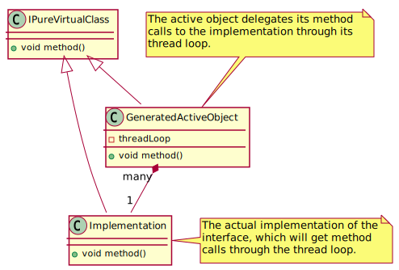

Clang Active Object Generator
=============================

**Clang active object generator** is a clang plugin for C++ code which generates an active object
from a pure virtual class. An [active object](https://en.wikipedia.org/wiki/Active_object) is a design
pattern which decouples method execution from method invocation for objects that each reside 
in their own thread of control.



Usage
=====
1. Install the clang active object generator (see [Build Plugin](#build-plugin))
1. You need a header file with a pure virtual class inside e.g.: IPureVirtualClass.hpp.
    ```c++
    #pragma once
    
    class IPureVirtualClass {
    public:
        virtual ~IPureVirtualClass() = default;
        virtual void foo(int a) = 0;
    };
    ```
   
2. Call the generator script with the header file name and the interface name. The script will
print a generated interface implementation using the active object pattern to standard out.
    ```bash
    
    clang-active-object-generator.sh IPureVirtualClass.hpp IPureVirtualClass \
        > IPureVirtualClassActiveObject.hpp
    
    ```
3. The generator script will create an active object header file for you e.g.:
    ```c++
    #pragma once
    /*
     * This file was generated by the ClangActiveObjectGenerator
     */
    
    #include "IPureVirtualClass.hpp"
    #include <boost/asio/io_service.hpp>
    #include <memory>
    
    class IPureVirtualClassActiveObject : public IPureVirtualClass {
    public:
      IPureVirtualClassActiveObject(const std::shared_ptr<IPureVirtualClass>& impl, boost::asio::io_service& ioService)
          : m_impl(impl)
          , m_ioService(ioService)
      {
      }
    
    public: // IPureVirtualClass
        void foo(int a) override {
            m_ioService.post(
                [this, a](){
                    m_impl.lock()->foo(a);
                });
        }
    
    
    private:
       std::weak_ptr<IPureVirtualClass> m_impl;
       boost::asio::io_service& m_ioService;
    };
    
    template <class TInterface, class TExecutor>
    std::unique_ptr<TInterface>
    make_active_object(const std::shared_ptr<TInterface>& impl, TExecutor& executor);
    
    template <>
    std::unique_ptr<IPureVirtualClass> make_active_object<IPureVirtualClass, boost::asio::io_service>(
            const std::shared_ptr<IPureVirtualClass>& impl, boost::asio::io_service& ioService)
    {
        return std::make_unique<IPureVirtualClassActiveObject>(impl, ioService);
    }
    ```
4. Finally, include the generated active object header into your sources and call methods on the active object
    ```c++
    #include "IPureVirtualClass.hpp"             // <-- original interface header
    #include "IPureVirtualClassActiveObject.hpp" // <-- generated active object header
    
    #include <boost/asio.hpp>
    #include <thread>
    #include <iostream>
    
    class Impl : public IPureVirtualClass {
        void foo(int a){
            std::cout << a << std::endl;
        }
    }
    
    int main()
    {
        // Thread loop in which the active object method calls will be executed
        boost::asio::io_service ioService0;
     
        // The implementation of the interface
        auto impl = std::make_shared<Impl>();
        
        // Generates the active object 
        auto implActiveObject = make_active_object<IPureVirtualClass>(impl, ioService0);
        
        // Puts the method call into the thread loop
        implActiveObject->foo(42);
    
        // Executes the method call (prints 42)
        std::thread t0([&ioService0]() { ioService0.run(); });
        t0.join();
    
        return 0;
    }
    ```
Build Plugin
=============
```bash
mkdir build; cd build
cmake ..
cmake --build . --target install
```

Build Example
=============
Build the plugin in advance
```bash
mkdir build; cd build
cmake ..
cmake --build . --target clang_active_object_generator_example
./example/clang_active_object_generator_example
```

Dependencies
============
* C++14
* llvm 6.0.1-4
* clang 6.0.1-2

License
=======
MIT

Author
======
Written by Erik Zenker (erikzenker (at) hotmail.com)